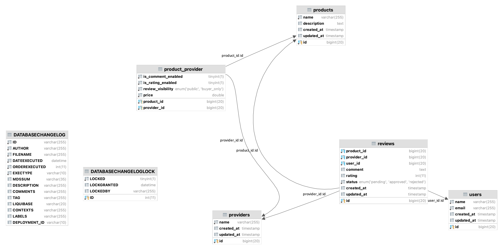

# Review Service App
To run the app set this property of you mariadb server in application.properties file 
spring.datasource.url
spring.datasource.username
spring.datasource.password

### ERD Diagram

### Test
There is postman collection on the spurce of app whcih you can impoer and use and just need to change the server host address

### Next Steps
* refactor design to enhance the performance for example we can use Redis for cache and less queries to db
* implementing unit and integration tests
* add more validations , ....
